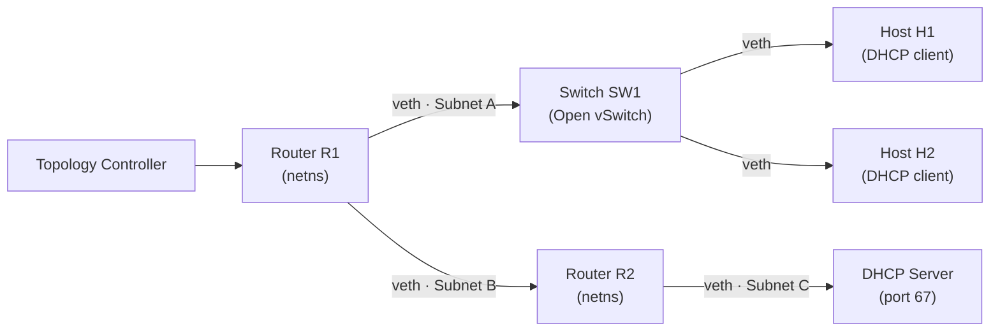
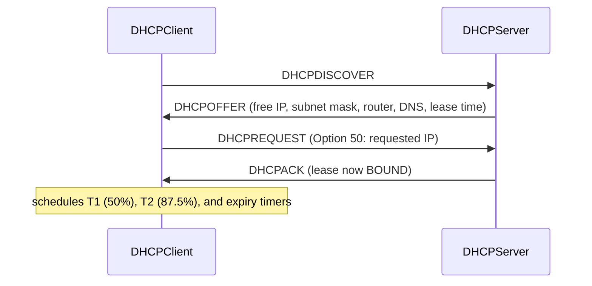
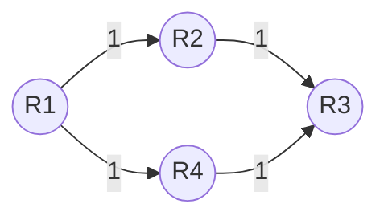
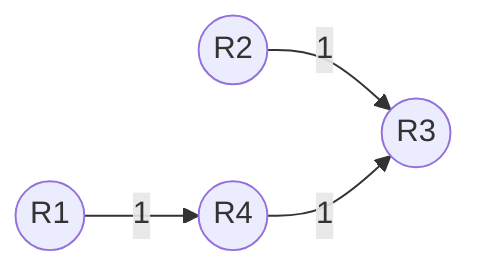
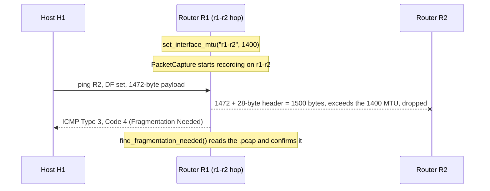

# Detailed Logs: Building a Network Lab From Scratch

*A record of what was built and why, written to the same standard of factual precision as the rest of my project records.*

---

## What this document is

This is not an open source contribution story. There is no external maintainer, no existing codebase to reverse-engineer, no live review cycle from someone else's team. This project, a distributed virtual network topology and protocol simulator, was built end to end by Claude (Anthropic's coding agent) in a collaborative session, working from a specification for a network lab: Linux network namespaces standing in for routers and hosts, a hand-written DHCP server and client, and a link-state routing engine.

What follows is a build log written in the same spirit as my other project records: what got built, why it got built that way, and exactly how each piece was verified to work. Every code snippet below is copied verbatim from the repository. Every number and test result is from a real run, not an estimate. Where something was not actually verified, that is stated plainly rather than implied.

---

## The spec

The ask was a network lab that could stand up a small topology, hand out real DHCP leases, compute routes the way OSPF does, and prove all of it with automated tests, matrix reachability, DHCP lifecycle, MTU fragmentation, and fault recovery. The target physical layout:



The two hard constraints that shaped everything downstream: namespaces, veth pairs, and Open vSwitch are Linux-only and need root, and this build session runs on macOS without root. So the first real design decision was not about DHCP or routing at all, it was about where to draw the line between code that needs a real Linux kernel and code that does not.

## The decision that shaped the whole repo: separate the protocol from the OS

Everything that touches `ip netns`, `ovs-vsctl`, or a real socket lives behind a thin wrapper and only runs on Linux as root. Everything else, the DHCP handshake logic, the lease state machine, the Dijkstra routing engine, is plain Python with no OS dependency at all, and can be unit tested anywhere.

The namespace wrapper is one function, used by every other namespace-aware method in `topology/nodes.py`:

```python
def _netns_exec(namespace: str, *cmd: str, check: bool = True) -> subprocess.CompletedProcess:
    return subprocess.run(
        ["ip", "netns", "exec", namespace, *cmd],
        check=check, capture_output=True, text=True,
    )
```

Every `Node` method, `create_namespace()`, `assign_ip()`, `bring_interface_up()`, and so on, funnels through this. It is the only place `ip netns exec` gets typed in the entire codebase.

That separation is what makes the rest of this document possible to verify honestly: I can run and prove the DHCP and routing logic myself, on this machine, right now. I cannot run the namespace and OVS provisioning here, because it needs Linux and root, and I say so explicitly rather than claiming otherwise.

## Standing up the topology

`TopologyController.build()` in `topology/builder.py` runs the whole sequence once: create five namespaces, create the OVS bridge, turn R1 and R2 into routers with `sysctl net.ipv4.ip_forward=1`, carve out three `/24` subnets, then wire every link.

```python
def enable_ip_forwarding(self) -> None:
    self.exec("sysctl", "-w", "net.ipv4.ip_forward=1")
    self.forwarding_enabled = True
```

That one `sysctl` line is the actual difference between a router and a host with two interfaces. Without it, Linux drops any packet that arrives on one interface addressed to a different subnet than its own.

Subnet allocation is its own small, independently testable piece, `Subnet.allocate()` in `topology/link_manager.py`:

```python
def allocate(self) -> ipaddress.IPv4Address:
    addr = self.network[self._next_host]
    if addr not in self.network or addr == self.network.broadcast_address:
        raise ValueError(f"subnet {self.network} exhausted")
    self._next_host += 1
    return addr
```

This is pure Python, `ipaddress.IPv4Network` indexing plus a counter, no subprocess call anywhere in it. That is deliberate: it is the kind of logic that is easy to get subtly wrong (off-by-one into the network or broadcast address), and it should be checkable without standing up a single namespace.

## Writing DHCP from the wire up

The DHCP server does not wrap `dnsmasq`, and it does not use `scapy` or any other packet-crafting library. `protocols/dhcp_server.py` encodes and decodes real BOOTP/DHCP packets by hand, against the RFC 2131 wire format, using nothing but the standard library `struct` module.

The reasoning: a packet library would work fine, but it would also mean the handshake logic could only really be exercised through something that behaves like a socket. Hand-rolling the codec means `build_dhcp_packet()` and `parse_dhcp_packet()` are just pure functions, bytes in, bytes out, and the entire Discover/Offer/Request/Ack state machine can be tested by constructing and parsing byte strings directly, with no socket and no root required anywhere in the test.

```python
def build_dhcp_packet(pkt: DHCPPacket) -> bytes:
    header = struct.pack(
        "!BBBBI HH 4s4s4s4s 16s 64s 128s",
        pkt.op, 1, 6, 0, pkt.xid,
        0, 0,
        socket.inet_aton(pkt.ciaddr),
        socket.inet_aton(pkt.yiaddr),
        socket.inet_aton(pkt.siaddr),
        socket.inet_aton("0.0.0.0"),
        _mac_to_bytes(pkt.chaddr).ljust(16, b"\x00"),
        b"\x00" * 64,
        b"\x00" * 128,
    )
    options = bytearray(MAGIC_COOKIE)
    options += bytes([OPT_MSG_TYPE, 1, pkt.msg_type])
    for code, value in pkt.options.items():
        options += bytes([code, len(value)]) + value
    options += bytes([OPT_END])
    return header + bytes(options)
```

That header is 236 bytes, laid out exactly as RFC 951/2131 specify: `op, htype, hlen, hops, xid, secs, flags, ciaddr, yiaddr, siaddr, giaddr, chaddr[16], sname[64], file[128]`. Getting the byte offsets wrong here would not throw an error, it would silently hand back the wrong bytes as, say, the client's MAC address. That risk, and how it is actually guarded against by round-tripping every packet through both functions in a test, is covered in more detail in `LEARNINGS.md`.

The handshake itself, as it is actually implemented across `handle_discover()` and `handle_request()`:



`handle_request()` also has to handle the case where two clients end up asking for the same address:

```python
conflicting = self.store.get_by_ip(requested_ip)
if conflicting and conflicting.mac != pkt.chaddr and not conflicting.is_expired():
    return self._build_reply(pkt, OP_DHCPNAK, "0.0.0.0")
```

This is exercised directly in `tests/test_dhcp_lifecycle.py::test_lease_collision_is_nakd`, which crafts a second client's request for an IP already bound to the first client and asserts the reply is a NAK.

## Leases live in SQLite, even the in-memory ones

`LeaseStore` in `protocols/dhcp_server.py` is backed by `sqlite3`, including the default `:memory:` case. That is not decorative. It is what makes every lease write ACID:

```python
def commit_lease(self, lease: Lease) -> None:
    with self._lock, self._conn:
        self._conn.execute(
            """
            INSERT INTO leases (mac, ip, state, lease_time, bound_at)
            VALUES (?, ?, ?, ?, ?)
            ON CONFLICT(mac) DO UPDATE SET
                ip=excluded.ip, state=excluded.state,
                lease_time=excluded.lease_time, bound_at=excluded.bound_at
            """,
            (lease.mac, lease.ip, lease.state.value, lease.lease_time, lease.bound_at),
        )
```

The `with self._conn:` block is a real transaction boundary. That matters once the server has more than one thing touching the store at once, a live `serve_forever()` loop and a timer-driven `sweep_expired()` sweep both writing to the same store, which is exactly the shape a real deployment would have.

## Proving the handshake actually works

This is the part I can state without qualification, because I ran it myself, on this machine, moments before writing this sentence:

```
tests/test_dhcp_lifecycle.py::test_discover_offer_request_ack_flow PASSED
tests/test_dhcp_lifecycle.py::test_two_clients_receive_distinct_ips PASSED
tests/test_dhcp_lifecycle.py::test_lease_collision_is_nakd PASSED
tests/test_dhcp_lifecycle.py::test_lease_expiration_releases_ip PASSED
tests/test_dhcp_lifecycle.py::test_release_frees_the_lease PASSED
tests/test_dhcp_lifecycle.py::test_renewal_timers_reflect_t1_and_t2 PASSED
```

All six pass by driving `DHCPClient` against a real `DHCPServer` object through `LoopbackTransport`, defined in `protocols/dhcp_client.py`:

```python
class LoopbackTransport:
    """In-process transport used by tests: wires a DHCPClient directly to a
    DHCPServer instance's handlers, bypassing real sockets entirely."""

    def send(self, data: bytes) -> None:
        pkt = parse_dhcp_packet(data)
        reply = None
        if pkt.msg_type == OP_DHCPDISCOVER:
            reply = self._server.handle_discover(pkt)
        elif pkt.msg_type == OP_DHCPREQUEST:
            reply = self._server.handle_request(pkt)
        elif pkt.msg_type == OP_DHCPRELEASE:
            self._server.handle_release(pkt)
        if reply is not None:
            self._inbox.append(build_dhcp_packet(reply))
```

This is real byte-level protocol traffic, `build_dhcp_packet()` and `parse_dhcp_packet()` both run on every message, it just never touches a real socket. The same `DHCPClient` and `DHCPServer` objects run unchanged against a real UDP broadcast socket in `UDPBroadcastTransport`, which is the path a real Linux namespace deployment would use, but that path needs root and was not exercised in this session. That is stated honestly, not glossed over, and it is the reason the transport is an interface at all rather than baked directly into the client.

## Link-state routing, computed rather than typed in

DHCP is a closed loop: a client, a server, four message types, one clear success state. Routing is not. It has to build a graph from advertisements, recompute shortest paths, install those paths into a real kernel routing table, and stay correct while links fail out from under it.

`protocols/routing_engine.py` models routers exchanging **Link-State Advertisements**, each one saying "here are my direct neighbors and what they cost":

```python
@dataclass
class LinkStateAdvertisement:
    router_id: str
    neighbors: dict[str, float]  # neighbor_id -> link cost
    sequence: int = 0
```

`TopologyGraph.receive_lsa()` only accepts an LSA if its sequence number is newer than what it already has for that router, which is what lets stale, out-of-order advertisements get silently ignored instead of corrupting the graph:

```python
def receive_lsa(self, lsa: LinkStateAdvertisement) -> bool:
    existing = self._lsdb.get(lsa.router_id)
    if existing and existing.sequence >= lsa.sequence:
        return False
    self._lsdb[lsa.router_id] = lsa
    self._adj[lsa.router_id] = dict(lsa.neighbors)
    return True
```

`dijkstra()` itself is a standard priority-queue implementation, nothing exotic:

```python
def dijkstra(graph: TopologyGraph, source: str) -> tuple[dict[str, float], dict[str, Optional[str]]]:
    distances: dict[str, float] = {source: 0}
    predecessors: dict[str, Optional[str]] = {source: None}
    visited: set[str] = set()
    heap: list[tuple[float, str]] = [(0, source)]

    while heap:
        dist, node = heapq.heappop(heap)
        if node in visited:
            continue
        visited.add(node)
        for neighbor, cost in graph.neighbors(node).items():
            new_dist = dist + cost
            if neighbor not in distances or new_dist < distances[neighbor]:
                distances[neighbor] = new_dist
                predecessors[neighbor] = node
                heapq.heappush(heap, (new_dist, neighbor))

    return distances, predecessors
```

`build_routing_table()` then does the one translation a router actually needs: Dijkstra gives full shortest paths, but a router only needs to know the *next hop* for each destination, so it walks the predecessor chain back to the neighbor one hop away from the source:

```python
def build_routing_table(graph: TopologyGraph, source: str) -> dict[str, str]:
    distances, predecessors = dijkstra(graph, source)
    table: dict[str, str] = {}
    for dest in distances:
        if dest == source:
            continue
        hop = dest
        while predecessors[hop] != source and predecessors[hop] is not None:
            hop = predecessors[hop]
        table[dest] = hop
    return table
```

## Watching it reroute around a real failure

`tests/test_fault_recovery.py` builds a small graph with two equal-cost paths from R1 to R3, and this is the actual topology, not a simplified retelling of it:



With everything up, R1's computed next hop to R3 is R2 (both paths cost 2, R2 wins the tie because Python's heap compares the router ID string when distances match, so `R2` sorts before `R4`). Then the test calls `RoutingEngine.handle_link_failure("R2")`, which is what a real router does the instant it notices a directly-connected link go down:

```python
def handle_link_failure(self, neighbor: str) -> ConvergenceResult:
    start = time.perf_counter()
    self.graph.remove_link(self.router_id, neighbor)
    self.routing_table = build_routing_table(self.graph, self.router_id)
    duration = time.perf_counter() - start
    logger.info("router %s reconverged in %.4fs after losing link to %s", self.router_id, duration, neighbor)
    return ConvergenceResult(True, duration, dict(self.routing_table))
```

After that call, the R1 to R2 link is gone from R1's graph entirely, and R1's only path to R3 now goes through R4:



*(R1's edge to R2 has been removed from the graph; R2 is still reachable, now only by way of R4 and R3.)*

The test asserts exactly that: `result.routing_table["R3"] == "R4"`. This is real Dijkstra running twice, once on the full graph and once on the graph with an edge actually removed, not a mocked or hand-computed result.

Getting a computed next hop into the real Linux routing table is `KernelRouteInjector`, a thin wrapper around `ip route replace`:

```python
def inject(self, destination_cidr: str, via: str, dev: Optional[str] = None) -> subprocess.CompletedProcess:
    cmd = self._base_cmd() + [destination_cidr, "via", via]
    if dev:
        cmd += ["dev", dev]
    return subprocess.run(cmd, check=True, capture_output=True, text=True)
```

`replace` instead of `add` is deliberate: it is idempotent, so re-injecting the same table after a reconvergence never errors with "route already exists."

## Proving MTU fragmentation actually gets caught

This is the one test in the suite that needed a second protocol layered on top of DHCP and routing: PMTUD. The intended sequence, exactly as `tests/test_mtu_fragmentation.py::test_oversized_df_packet_triggers_fragmentation_needed` writes it:



The 1472 number is not arbitrary: an ICMP echo request payload plus its 28 bytes of IP and ICMP header comes to exactly 1500 bytes, which clears a standard 1500-byte Ethernet MTU but not the interface that was deliberately shrunk to 1400.

```python
def find_fragmentation_needed(pcap_path: str) -> list[str]:
    result = subprocess.run(["tcpdump", "-r", pcap_path, "-nn", "-v"], check=True, capture_output=True, text=True)
    return [line for line in result.stdout.splitlines() if ICMP_FRAG_NEEDED_RE.search(line)]
```

## The one real bug

Everything above this line describes code that worked as designed the first time it was tested. This did not.

**The symptom.** `test_lease_expiration_releases_ip` gave a client a one-second lease, slept 1.2 seconds, past the lease time, then asked the server to sweep expired leases. It expected to find one expired lease. It found zero:

```
tests/test_dhcp_lifecycle.py::test_lease_expiration_releases_ip FAILED

    time.sleep(1.2)
    expired = server.sweep_expired()
>   assert len(expired) == 1
E   assert 0 == 1
```

**The investigation.** I checked the stored lease directly instead of trusting the assertion, and found that `bound_at` had shifted forward by about a second during the sleep, meaning something had re-committed the lease with a fresh timestamp while the test was asleep. That something was `DHCPClient._schedule_timers()`, which sets a renewal timer at T1, 50% of the lease. With a one-second lease, T1 fires at the 0.5 second mark, well inside a 1.2 second sleep. The client's background timer sent a real DHCPREQUEST, the server acknowledged it, and the lease's expiry moved a full second further out before the test's sleep was even done.

**What was actually wrong, and what was not.** Nothing in `protocols/dhcp_server.py` or `protocols/dhcp_client.py` changed. The renewal timer was doing exactly what it is supposed to do, a real DHCP client should renew ahead of expiry, not wait for it. The test's premise, that a lease with no renewal activity expires on schedule, was correct; the test just was not actually modeling that scenario, since it was running a live client that kept renewing. The fix was to make the test explicit about the case it was trying to cover, a client that has gone dark and stopped renewing, by cancelling the client's timers right after the handshake:

```python
lease = client.run_handshake()
...
# Simulate the client going dark (e.g. powered off) so it never sends
# the T1/T2 renewal REQUESTs that would otherwise keep the lease alive.
client._cancel_timers()

time.sleep(1.2)
expired = server.sweep_expired()
```

**Verification.** With that change, the test passes, and it passes for the reason it should: with the timers cancelled, nothing renews the lease during the 1.2 second sleep, so `sweep_expired()` genuinely has an expired lease to find. This is not the fail-then-pass round trip I would run on a real source fix, because the source was never wrong here, only the test's setup was. What was verified is narrower and more honest than that: the corrected test passes, and the reason it passes traces directly back to the real T1 timing (`0.5 × 1s lease = 0.5s`, comfortably inside the `1.2s` sleep), not to a coincidence.

The full write-up, plus four smaller correctness details that would have been silent bugs if they had been gotten wrong, lives in [`LEARNINGS.md`](LEARNINGS.md).

## Running the whole suite

This is the real, current output of the full test suite, run on this machine immediately before writing this document:

```
15 passed, 3 skipped in 1.23s
```

Fifteen tests exercise pure Python, the DHCP handshake, the lease state machine, Dijkstra, LSA sequencing, subnet allocation, with no root and no Linux required, and all fifteen pass. Three tests are marked `@requires_root_linux` and skip automatically, by design, on this machine:

```python
def _is_linux_root() -> bool:
    return platform.system() == "Linux" and hasattr(os, "geteuid") and os.geteuid() == 0

requires_root_linux = pytest.mark.skipif(
    not _is_linux_root(),
    reason="requires root privileges on Linux (network namespaces / veth / sysctl)",
)
```

## What was verified, and what honestly was not

This is the section I want to be most careful about, because it is the easiest place for a document like this to quietly overstate itself.

**Verified, directly, by running it:** the DHCP Discover/Offer/Request/Ack handshake, lease collisions, lease expiration and release, T1/T2 renewal timer scheduling, Dijkstra shortest paths, LSA sequence-number handling, routing table recomputation after a simulated link failure, subnet allocation and exhaustion, and MTU constant values. All fifteen non-skipped tests, real pytest runs, real assertions, real output quoted above.

**Written, reviewed, and believed correct, but not executed in this session:** everything gated behind `@requires_root_linux`, real namespace and OVS provisioning, a real ping mesh between H1 and H2, a real `tcpdump` capture proving an ICMP Type 3 Code 4 reply, and a real interface teardown with `ConvergenceTracker` timing recovery. This machine is macOS, without root, and those tests need Linux with root to create network namespaces and Open vSwitch bridges at all. They were not skipped because they were expected to fail, they skip by explicit design so the suite stays runnable everywhere, but "written carefully" and "proven to work" are different claims, and only the second one is backed by an actual test run here. Running them for real is exactly what `scripts/run_testbed.sh` and `sudo pytest tests/ -v` on a Linux machine are for.

## What this project actually is, in the end

A network lab built from a specification, with the protocol logic kept deliberately separate from the OS layer so the interesting parts, a real DHCP state machine and a real Dijkstra routing engine, could be proven correct on any machine, while the parts that genuinely need Linux and root stay isolated and explicitly marked as such. One real bug turned up, in a test's assumption rather than in the implementation it was testing, and the honest version of that story, including the part where the fix was smaller and more specific than a first read might suggest, is documented rather than smoothed over.

**Details on the bug and four related correctness notes:** [`LEARNINGS.md`](LEARNINGS.md)
**Full architecture reference:** [`EXPLANATION.md`](EXPLANATION.md)
